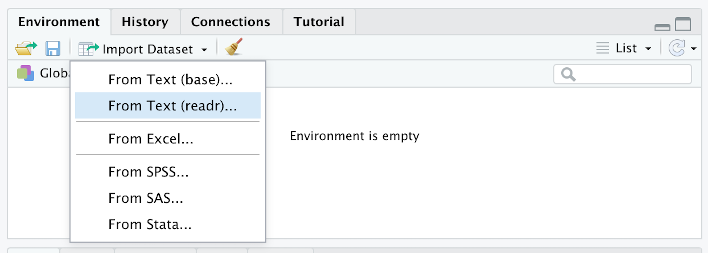
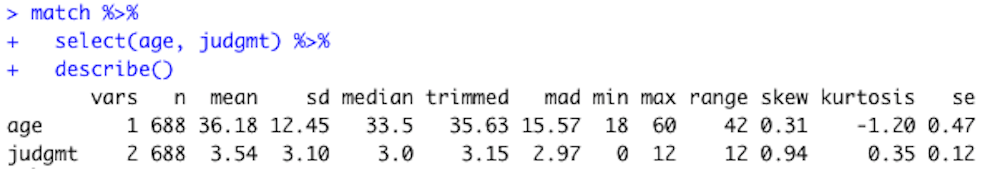
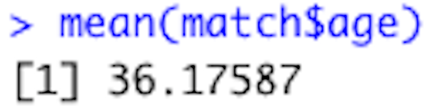
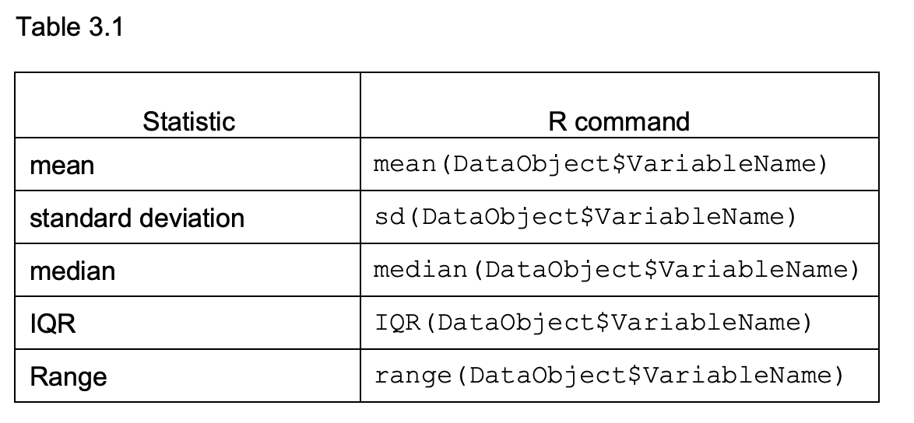
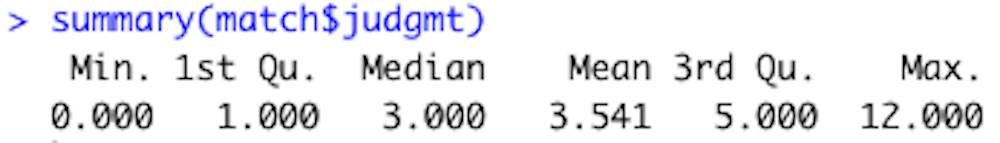

# Descriptive Statistics

```{r, include = FALSE}

library(tidyverse)
library(psych)

match <- read_csv("matchdatacmplt.csv")


```

After you look at your data, the next step in the data analysis process is to compute descriptive statistics. In this chapter you will learn how to use RStudio to compute measures of central tendency and variability.   

## RESEARCH QUESTION

Let’s continue with the match.com example from chapters 1 and 2. In this example we are pretending to be interested in the judgement of people on dating apps – its frequency and its relation to age and education.   
  
In the last chapter we looked at tables and graphs that told us a bit about the people in our sample in regard to their education, age, and how often they self-report judging others. In this chapter we will add numbers to this understanding with descriptive statistics.  

## METHOD 

Pretend that you worked with Dr. Amanda Gesselman and her colleagues at the Kinsey Institute to create self-report survey items about how often participants judge others. These items were added to a longer semi-proprietary survey about the attitudes and behaviors of single people in the US. This survey was sent to certain people with accounts on match.com. The people were selected so that the demographics match the most recent US census, with oversampling for gay, lesbian, and bisexual participants. Thousands of people completed the survey. We will use a random sample of 688 people from the total sample here.    

## DATA ANALYSIS OVERVIEW

The data is in file matadatacmplt.csv. This is the same dataset that we used in the introduction chapter - except that the total judgment variable is included matadatacmplt and not in the matchdata.csv file.  

*	The first column contains arbitrary ID numbers to identify the participants    
*	The next column contains the participants’ ages  
*	The third column contains the participants’ highest level of education  
* The following 12 columns contain the data from the judgement questions (0 = no; 1 = yes)  
*	The judgmt column contains the total number of times the participants reported judging others on the 12 items. (this is the variable you made in the data transformation section of the introduction chapter)  
*	The remaining variables are not relevant to the current chapter, so they are not defined here.  

After the data is opened and you have looked at the data with tables and graphs, the next step is to compute descriptive statistics. Descriptive statistics refer to measures of central tendency and variability. Measures of central tendency describe the middle of a distribution of scores. These statistics include the mean, median, and mode. Measures of variability describe the spread or dispersion of the distribution. The standard deviation, variance, and range are common measures of variability. Descriptive statistics are often calculated for the whole sample and also separately for different levels of a categorical variable.    

## OPEN DATA

First assign the dataset to an object called match (or whatever you prefer). You can do this with the point and click method by selecting from the environment menu:  
  
IMPORT DATASET -> FROM TEXT (READR)  
  



Click the BROWSE button and then navigate to your file’s location on your computer. Then click OPEN and then IMPORT.  
  
Or you could use the following code:      
  
`library(readr)`  
`match <- read_csv("matchdatacmplt.csv")`  

*	This command is telling R to assign the data in the matchdatacomplt.csv file to an object called match. 

Your screen should look like this after the data is imported:


## DESCRIPTIVE STATISTICS 

This section reviews two ways to compute descriptive statistics in RStudio. First, we will compute descriptive statistics using the psych and tidyverse packages. Then we will review how to use base R to compute them.  

### Psych and Tidyverse 
Let’s first load tidyverse, so that we can use pipes (`%>%`) in our commands:  

`library(tidyverse)`  
(or you could use the point and click method described in chapter 1)  

Then load the psych package:  
  
`library(psych)`  
(or you could use the point and click method described in chapter 1)  
  
Let’s compute descriptive statistics for the judgmental and age variables with the describe function of the psych package. This function was made to compute common descriptive statistics in psychology research. Here is the command:  

`DataObject %>%`  
  `describe()`  
  
* Replace DataObject with the name of the object that is storing the data  
   
In the current example the command looks like this:   
   
`match %>%`  
  `describe()`   
  
*	This command is saying to first go to the dataset named match and then describe it  
After this command is run, your screen should look like this:  

 

The first column lists the variable names. The vars columns numbers the variables. The next column reports the number of valid data points for each variable. The next is the mean. The sd in the following column stands for standard deviation. After the standard deviation is the median. In the next few columns trim stands for the trimmed mean; mad stands for median absolute deviation; min stands for minimum; max stands for maximum. The se in the last column stands for standard error.   

You can see that every variable in the match data set is listed in the first column. However, the statistics for some of the variables are meaningless, like the statistics listed in the id row for example (the mean of an arbitrary ID number doesn’t mean anything). Also, descriptive statistics cannot be calculated for categorical variables (which can result in warnings).    

The select command can be added in order to calculate descriptive statistics for only certain variables (use the pull function to select one variable). For example, this is the command to select only the age and judgment variables:  

`match %>%`  
  `select(age, judgmt) %>% `  
  `describe()`  
  
* This command is telling R to use the data in the match dataset then select the age and judgment variables then describe those variables.  

After you run that command, the follow will appear in the console:  

  


The mean age is 36.18 and the median is 33.5. The mean being greater than the median suggests a positive skew to the data because the older aged people in the tail of the distribution pull the mean age (36.18) to be greater than the 50% mark (33.5). The most frequent age is 24. The standard deviation is 12.45 years, which tells us most people are between 23 to 45 (36 +/- 12). The ages range from 18 to 60 years old.   
  
The mean judgmental score is 3.54, the median is 3, and the mode is 0 – suggesting that most people in the sample do not judge people very often (or they don’t admit to it at least). The standard deviation is 3.11, so most people in our sample said they judge other people based on between 0 to 6 things. The range was 0 to 12.   

### Base R
You could also use base R to compute descriptive statistics. There are functions to compute individual statistics. For example, the mean function calculates the mean of a variable. It looks like this:   
  
`mean(DataObject$VariableName)`  

*	Replace DataObject with the name of the object that is storing the data.  
*	Replace VariableName with the name of the variable.   
  
In the current example, this command would calculate the mean age of everyone in the sample:  
  
`mean(match$age)`  
  
The following will appear in the console after that is run from your script:  

  

Table 3.1 lists R commands for other common statistics. Replace DataObject with the name of the object that is storing the data and replace VariableName with the name of the variable.  

  

Add na.rm = TRUE after in the parenthesis if there is missing data in the variable (i.e. `mean(DataObject$VariableName, na.rm = TRUE) `)  
  
The summary function (`summary(DataObject$VariableName)`) calculate minimum, 25% point, median, mean, 75% point, and maximum point at the same time. For example, use the following for code to use the summary function of the judgment variable:  
  
`summary(match$judgmt)`  
  
After this is run from the script, the following will appear in the console:  

  

## DESCRIPTIVE STATISTICS BY GROUP 
  
Next let’s compute the judgment descriptive statistics separately for each level of the education variable. To do this let’s use the describeBy function of the psych package, which reports basic summary statistics by a grouping variable. Here is the command:  

`DataObject %>%`
  `pull(Variable1Name) %>% `
  `describeBy(DataObject$Variable2Name)`
  
*	Replace DataObject with the name of the object that is storing the data.
*	Replace Variable1Name with the name of the variable that you want to describe. Use the select function instead of the pull function with more than one variable.  
*	Replace Variable2Name with the name of the grouping variable 
  
In the current example the command and results looks like:  
  
```{r message=FALSE, warning=FALSE}
match %>%
  pull(judgmt) %>% 
  describeBy(match$edu)

```

In this table we can see that the mean and median judgmental scores increase with educational attainment (high school or less: mean = 2.27, median = 2; two-year degree or some college: mean = 3.25, median = 3; bachelor’s degree: mean = 3.94, median = 3; graduate or professional degree: mean = 4.29, median = 4). The most common judgmental score was zero for the participants with bachelor’s degrees or less. The mode of the participants with graduate or professional degree was 3.   

Based on the standard deviations, there were slightly more variability in the scores at the higher level of education (high school or less = 2.55; two-year degree or some college = 3; bachelor’s degree = 3.15; graduate or professional = 3.29). However, the range was the same for all levels of education.   


