# Introduction  

This chapter introduces the RStudio cloud environment and describes how to import data into the RStudio cloud.   

R cannot handle typos and is case sensitive (‘Gender’ is not the same as ‘gender’). If your code will not run check for typos and caps.    

Related to this point, do not be afraid to copy and paste with using R. I often copy and paste code and replace variable or dataset names as needed. (This is one of the few times in education where copy and paste is OK!)  

## Make a project in RStudio cloud

When using RStudio in the cloud you should first open a new project by clicking on the new project button in the top right hand side of the RStudio cloud website. Make sure you are in the shared class workspace when you do this - it should say PSYC 211 in the top right.  

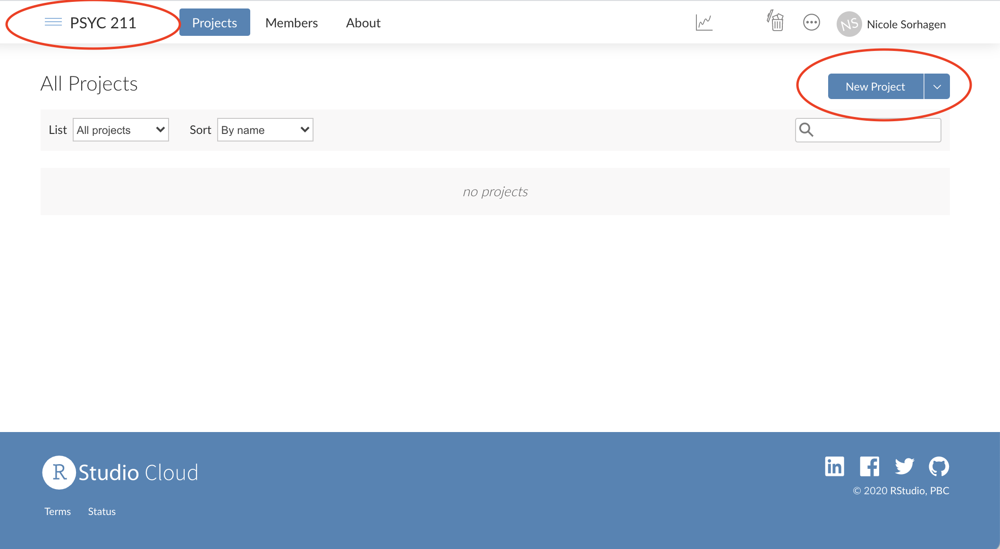  

If it does not - click on the hamburger button and then select the PSYC 211 shared workspace. 

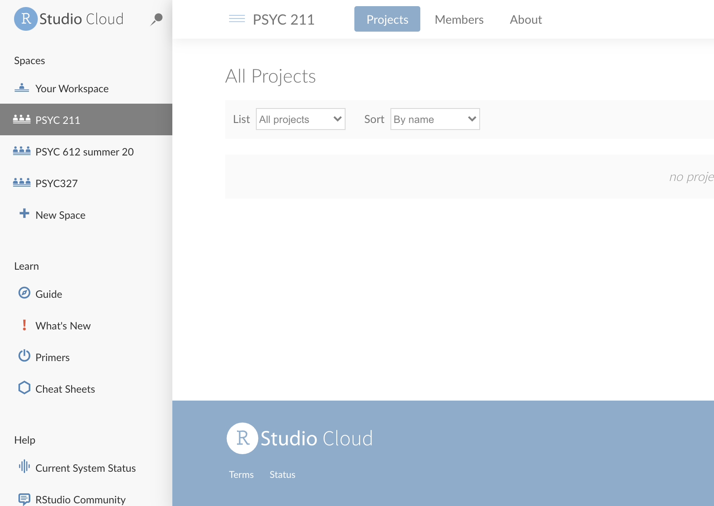 

## WINDOWS IN RSTUDIO  

RStudio has four panes or windows.  

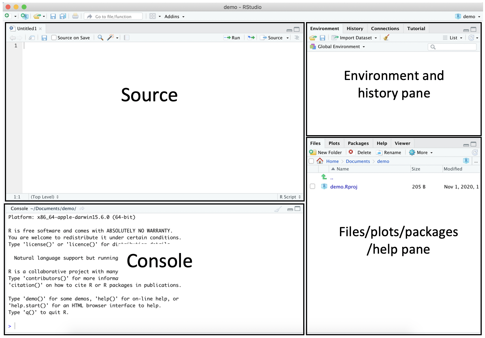  

### The Source Pane  

The source pane has several functions. The most important is that it is where you will write and run R commands. In this book we will use a R script files to do this, which are similar to text files. Another popular file type to write and run R commands in is a R markdown file, which can automatically create reports and manuscripts (see the appendix for more information about R markdown files). The source pane can also display datasets in a spreadsheet like format. The variable names will be listed at the top of each column, followed by the raw data. Multiple files can be opened in the source pane at the same time – there will be a tab for each opened file at the top of the pane.   

### The Console Pane  

The console or terminal pane shows a record of the tasks or analyses you have asked RStudio to complete. After you run a command from a R script in the source pane, the execution and output will appear in the console pane.   

The > symbol in the last line of the console means that the console is ready for a command. If the > symbol is ever missing, click in the last line of the console and hit the escape button on your keyboard. A > symbol will then appear.    

While it is possible to type and run R commands in the console, typing commands in scripts in the source pane is better because the information in the console is not saved when RStudio is closed. When you reopen a project, the console will be reset. So, everything you want to save should be in the script.   

### The Environment And History Pane   

The environment pane shows what datasets and objects are currently defined in RStudio’s memory. The history tab contains a history of the R commands you’ve executed. This should be fairly redundant with your R scripts.  

### The Files/Plots/Packages/Help Pane   

This pane has several purposes. The file tab offers a way to open files in RStudio. The plots tab is where any plots you create will appear. The packages tab is where you can see what packages are currently loaded. You can also install and load packages from here. (Packages will be discussed in more detail in the next section.) Finally, the help tab displays documents to help you use R functions and packages.    

## NAVIGATING AND COMMANDS  

*Use R scripts to type and run commands*   

The first step of working in RStudio will always be to open a script.  

You can open an existing script by selecting it from the file tab in the files/plots/packages/help pane. R script files end in .R (the intro.R file, descripstats.R, and datavis.R files in the picture below are R script files. They contain the commands for chapters 1 to 3 of this guide. Or you could open an existing script by selecting FILE -> OPEN FILE in the top bar menu and then navigate to the file location.  

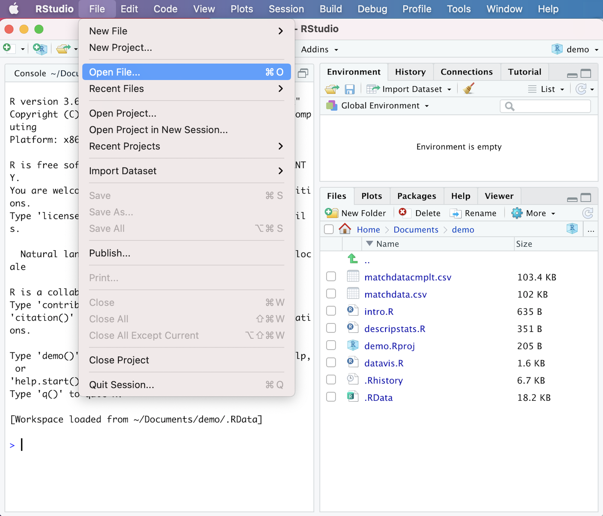  
Another option is to open a new script. Do this by selecting from the top bar menu: FILE -> NEW FILE -> R SCRIPT   

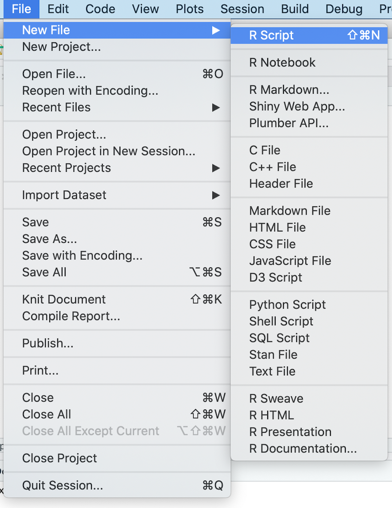   

Another way to open a new script is by clicking on the green circle with a cross in the middle and then selecting R Script.   
  
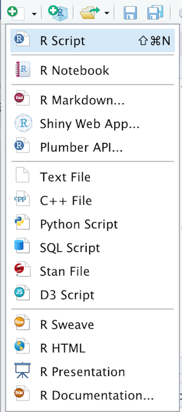    
  
To save a script, select from the top bar menu: FILE -> SAVE AS.   
  

*R is like a fancy calculator*  

In its most basic form, you can think of R as a fancy calculator. For example, type the following equation into the script:  

`2+2`  
  
Then, while the cursor is still in the same line as the equation, click the run button to have R calculate the equation (or run this command).   
  
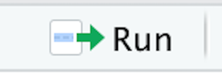  

The command (`2+2`) and results (`4`) will appear in the console.  

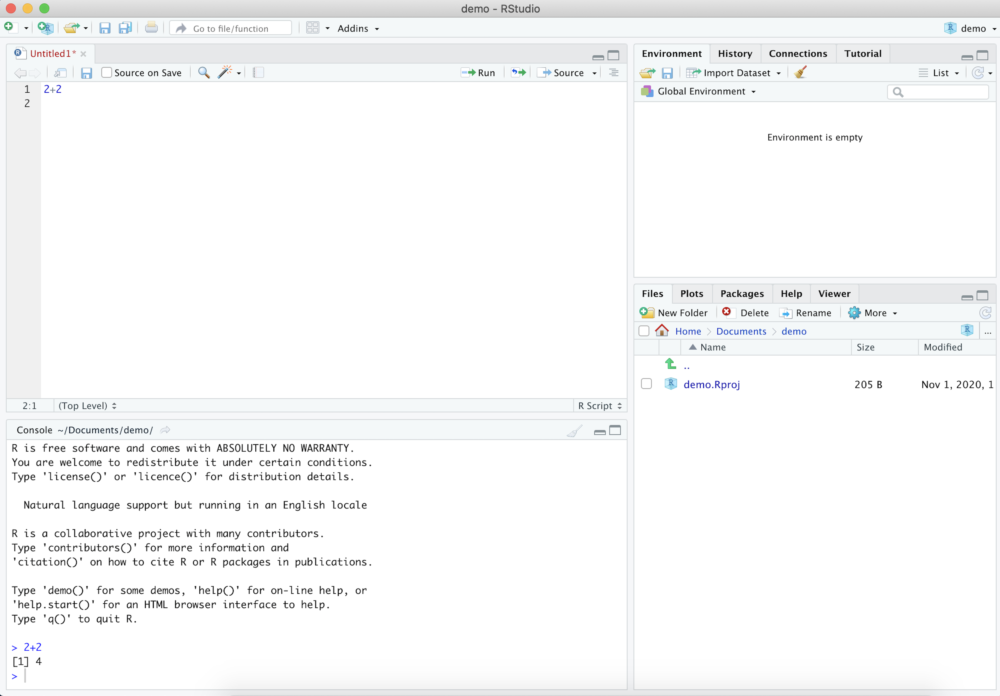   

You also could highlight the command you want to execute and then click on the run button. Another way to run a command in a script is by using the command (⌘) and enter keys on a mac (or control + enter on a PC).   

*Functions are what makes the calculator fancy.*   

In this book we will rarely calculate statistics by entering equations. Instead, we will use functions to tell R to use equations for us. For example, to find the mean of a set a scores (such as 2, 2, and 3) you could use the mean equation:    

`M = (∑X)/N  = =  (2+2+3)/3`    

This equation would be entered into R as `(2+2+3)/3`. After you run this command, the answer (`2.333333`) would appear in the console. Alternatively, you could use the mean function to tell R that you would like it to calculate the mean of the set of scores. (i.e., `mean(scores)`).   

*Functions act on arguments*   

Functions always have parentheses at the end of their names, and inside the parentheses is where you tell R more about what you want it to do. The information inside the parentheses are called arguments. In the same way that verbs act on nouns, functions act on arguments.   

*Information is stored in objects*   

An object in R stores information. Functions are a kind of object that stores equations or actions. Data are stored in objects called vectors and datasets. The results of an analysis can also be saved as an object, as needed.   

Information is assigned to objects with assignment operators. This guide will use the arrow assignment operator (`<-`). The equal sign can also be used as an assignment operator. Whatever is on the right of the assignment operator is assigned to whatever is on the left of the operator. For example, the command `match <- read_csv("matchdata.csv")` assigns the data in the file matchdata.csv to an object called match.  

All objects are listed in the environment. The environment can be cleared by clicking on the broom at the top of the environment tab. Or you could use the remove function. For example, `rm(match)` the object named match will no longer be listed in the environment.  

Use the `$` symbol to access variables within a dataset object (an object with multiple variables in it). For example, `match$age` accesses the variable called age in the dataset object called match. Another way to tell R what data object a variable is in is with a pipe, or `%>%`. Pipes are a way to write strings or series of functions more easily. You can think of it as saying “then”. For example `match %>% pull(age)` is telling R to first go to the dataset in the match object then pull the variable called age. In order to use pipes (`%>%`) a package called Tidyverse must be loaded – we will talk more about packages in the next section.  

*R quirks*

Before moving on, we need to talk about a few of R’s quirks. First, R is case sensitive. R will treat `mean` differently than `Mean`. Because of this some experts suggest always using lowercase letters when naming things. This is something to keep in mind when you are choosing names for the objects that store your data. 

Second, R cannot handle typos. If you accidentally typed ‘men’ instead of ‘mean’, R will not know that you really meant mean. The predictive text feature of RStudio can help with this. This means that RStudio will suggest functions and objects as you type.   

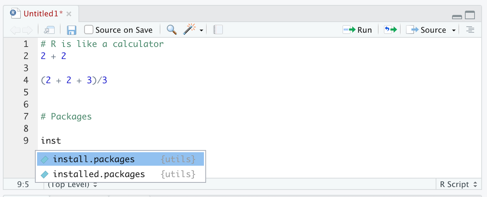    

Finally, R is ambivalent about spaces. R ignores redundant spaces in equations. For example, if you typed `2     +2` or `2+2` you would get the same answer as when you typed `2 + 2`. But there cannot be spaces in object names (this is another thing to keep in mind when naming objects), and there cannot be spaces between a function and its parentheses.  

When you get an error message after you run a command, check for capitalization errors, typos, and spacing.   

*Trial and error*  

In the last sentence I said when you get an error, not if you get an error. This is because errors and having a command not run is inevitable. Errors are just a part of coding. It is even people’s jobs to find the errors in professional coder’s code.  

I often have to play around with a command a bit because it will not run. I like to copy and paste a command and then try something different, so I can see what I already have tried.  

So, don’t sweat the errors! It happens to everyone!   

*Scripts should be a record of your analysis*  

While trial and error is expected, it should be clear in a script which commands were eventually used and which were not. This is part of making your scripts useable by others and your future self.  

Another way to make scripts shareable is to include notes using the hashtag (`#`). R will not treat anything in the same line as a hashtag as a R command.   

In the current script we are working on, we could add organization and explanations to our current script by adding `# R is like a calculator` above the equations we have run so far and `# Packages` to indicate the next section.   

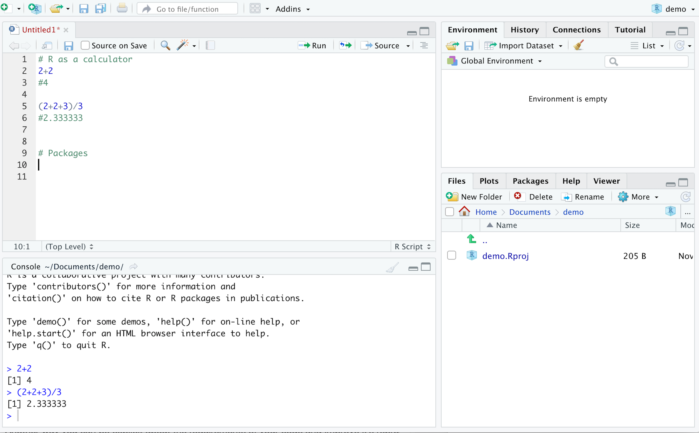   

Note that the comments appear green in the script.  

At the very least, you should include enough comments so that someone else (or even yourself in a few months or so) could read your script and get the basic idea of what you did. Beyond that, the content and degree to which comments are included in scripts is a personal choice. For example, sometimes people note the results of an analyses after its command and others do not. Remember that the information in the console is not saved after RStudio is closed. So, including the results in the script can be useful when you reopen a project.  

### Packages  

**Base R** refers to the functions that automatically come with R. But many people build on top of Base R to make R better. The way they do this is through **packages**, which contain new R functions. There are thousands of packages that could be added on to base R.  

Packages are kind of like apps on your smartphone or computer in several ways. First, there are often several packages that can equally do the same thing. Just like there are several apps that would tell you the weather, there are several packages that would compute descriptive statistics. Moreover, some packages are more well-known and popular than others, just as some apps are really popular and others are not. Like the more popular apps, the well-known packages tend to be well supported, meaning that they are updated, maintained, etc. In this guide I try to focus on the more popular packages.   

**Installing packages**  

Another way that packages are like smartphone apps is that they both have to be installed first before they can be used.  

In RStudio, packages can be installed through point and click or with a command.  

Let’s first use the point and click method to install a package called tidyverse. Tidyverse was created by Hadley Wickham and his team with the aim of making various aspects of data analysis in R easier. It is actually a collection of packages, and they include a lot of functions that many people think of as essential for data analysis.  

To install a package using the point and click method, select from the top bar menu:  

TOOLS -> INSTALL PACKAGES

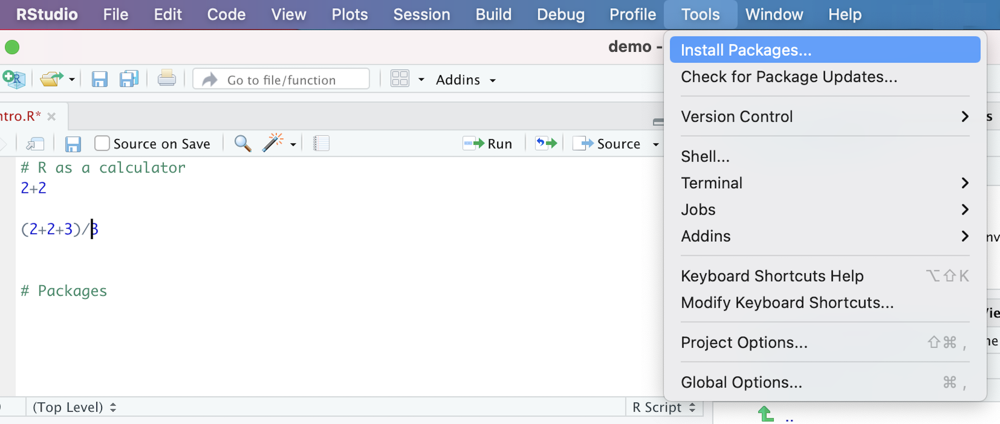   

In the install packages window, type the name of the package you would like to install. For example, type “tidyverse” in the packages box. Then click INSTALL.   

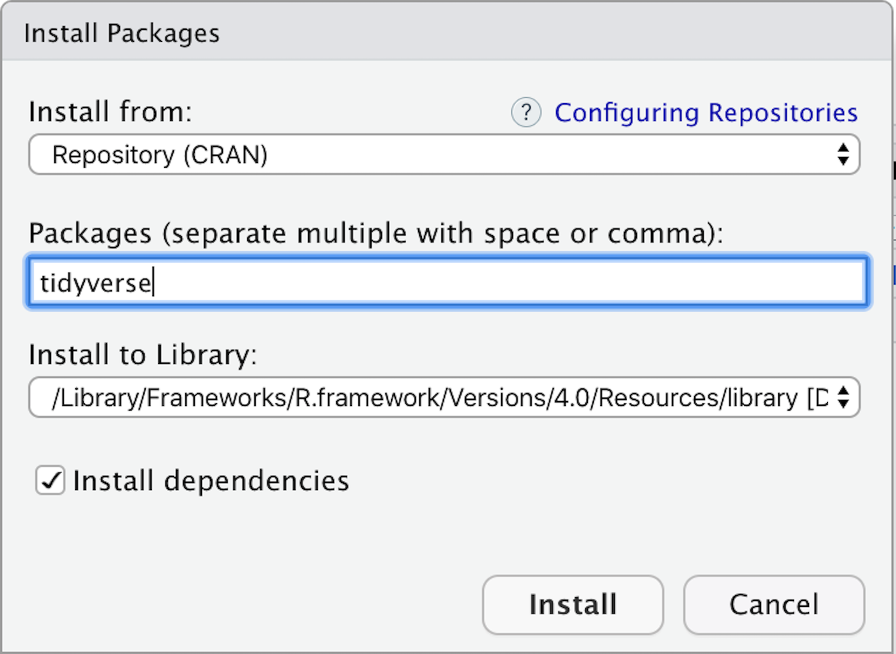   
Your screen should look like this when the installation is complete:   

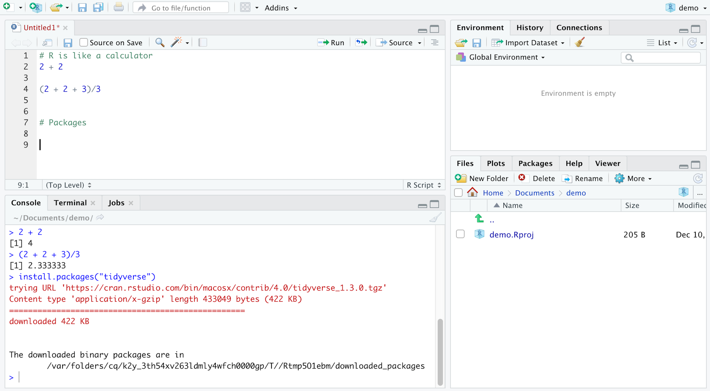   

Do not proceed until the console says the package has been installed.  

Another package we will be using a lot is the psych package. The **psych** package is a package for personality, psychometric, and psychological research. It has been developed at Northwestern University (maintained by William Revelle) to include useful functions for personality and psychological research.  

Let’s install this package with the install packages function. The basic setup of this function is:   

`install.packages(“PackageName”)`  

*	Replace `PackageName` with the name of the package that you want to install.  
*	Remember the quotation marks here!  

For example, install the psych package with the following command:  

`install.packages("psych")`  

After you type (or copy and paste) this command into a script. Highlight it (or click in the same line as in the command) and then click on the run button (or use the run hot keys).   

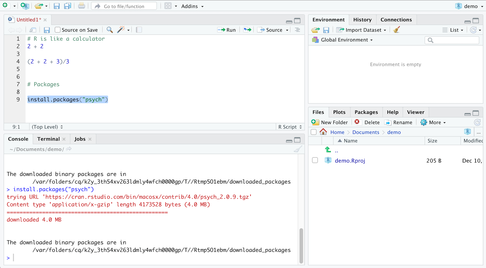   

Again, do not proceed until the console says the package has been installed.  

**Loading packages**  

In order to use a package, it must be loaded – just like in order to use an app on your smartphone, it must be opened. Another analogy is moving information from long term memory to working memory. You will need to load the packages you want to use each time you open RStudio.   

In RStudio, packages can be loaded with point and click or with a command.  

Let’s load tidyverse with the point and click method. To do this, first select the packages tab in the files/plots/packages/help pane.   

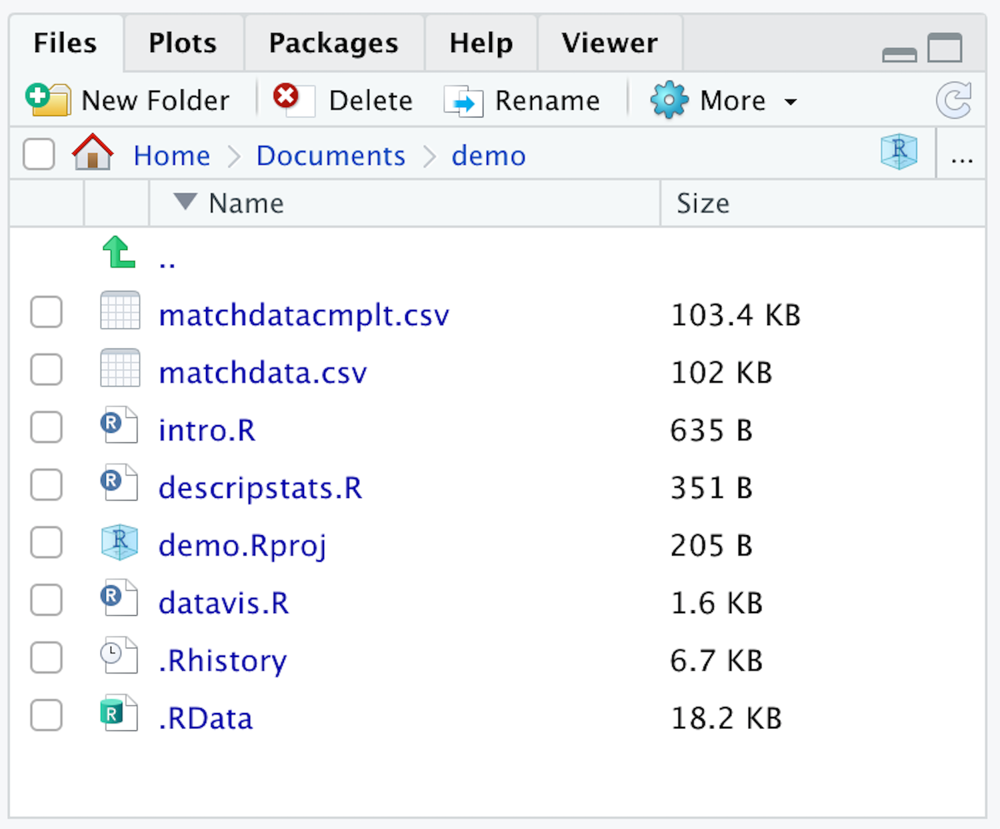   

Then type “tidyverse” in the search bar (or scroll through the list). Then check the box next to tidyverse. The loading process will appear in the console immediately.  

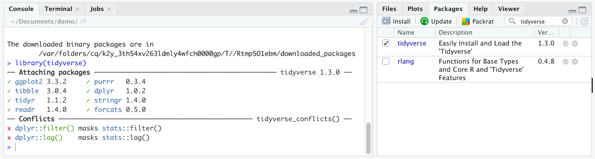  

The output in the console lists the 8 packages that make up Tidyverse (ggplot2, tibble, tidyr, readr, purr, dplyr, stringr, and forcats).   

Next let’s load the psych package with the library command. The basic set-up of this function is:  
`library(PackageName)`  

*	Replace `PackageName` with the name of the package.  

For example, load the psych package with this command:  
`library(psych)`  

After you run this code in the script, the loading process will appear in the console.  

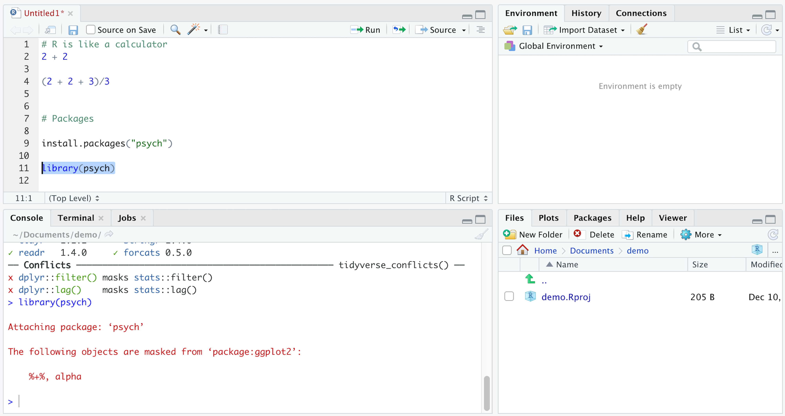  

Note that if you had already loaded Tidyverse, there will be a warning message telling you that the alpha function is masked from the ggplot2 package. This means that the psych package and the ggplot2 package both have a function called alpha. This is not a big deal. There is a way to tell R which alpha function you want to use.   

In summary, the first time you use a package, you need to install it. Once a package is installed, you will need to tell R that you want to use it by loading it. You only have to install a package in a project once. You will have to load a package every time you open RStudio and want to use it.   

## DATA THINGS  

Now that you have a sense of how to navigate and use commands in the RStudio program, let’s talk about data – how to enter it, how to open it, how to set it up correctly, and how to transform it.    

### Manual Entry  

Data can be added directly into RStudio. While it is more common to collect data in a spreadsheet or another programs and then open it in RStudio for data analysis, it is still important to review how to enter data directly into RStudio. This section will review how to go about doing this with an example about class tardiness. Let’s pretend that someone counted the number of times a week that five students were late for a class that meets on Mondays, Wednesdays, and Fridays. Here is their data:   

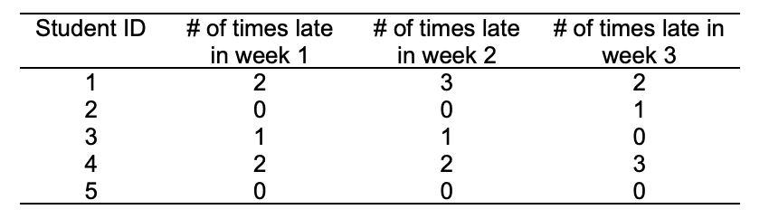  

Let’s use the concatenate, or combine, function to assign the data to an object. The basic setup of this function looks like this:  

`VariableName <- c(X1, X2, X3, etc.)`    

* The `VariableName <-` part of this command saves the data to an object. Replace `VariableName` with the name of the variable. Variable names should not have spaces or special characters in them. Naming variables is another part of making analyses shareable with others. Variable names should be informative but short (under 15 characters).  
* The c is the combine (or concatenate) function  
* In the parenthesis, list the data in a comma separated list.  

For example, here is the command to create the Student ID column:  

`id <- c(1, 2, 3, 4, 5)`  

* This command is telling R to save an object called studentid that is made up of this list of numbers `(1, 2, 3, 4, 5)`  

After you run this command, an object called ‘id’ will be listed in the environment pane.   

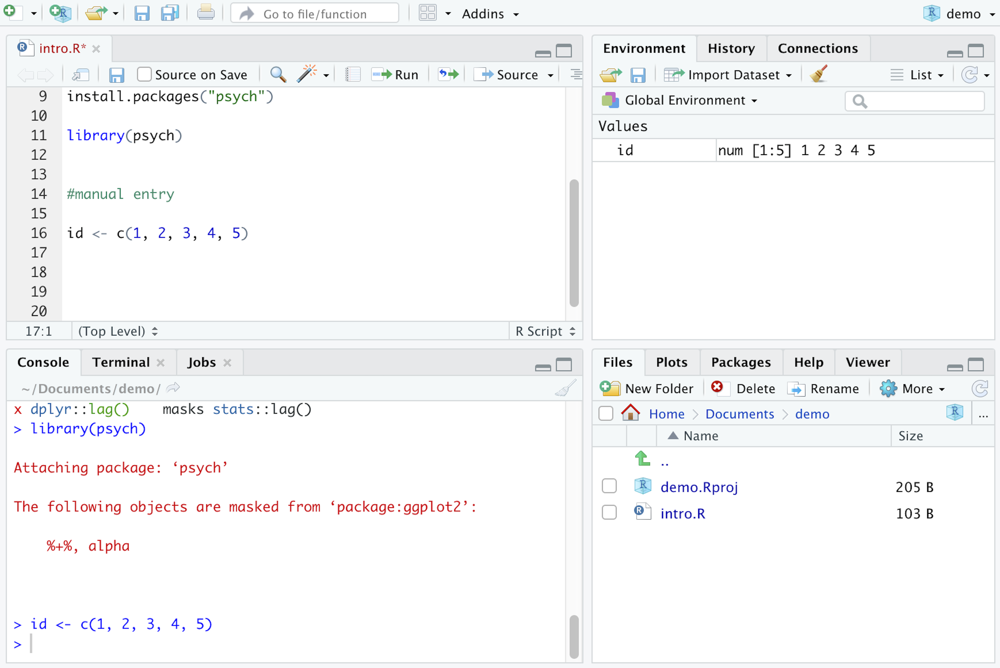  
Next let’s assign the data for the number of times the students were late in the first week. Let’s call this variable latew1 (for late week 1, or the number of times students were late the first week of the study). Here is the command:  
 
`latew1 <- c(2, 0, 1, 2, 0)`  

*	This command is telling R to save an object called latew1 that is made up of this list of numbers `(2, 0, 1, 2, 0)`  

After you run this command, an object called `latew1` will be listed in the environment pane.   

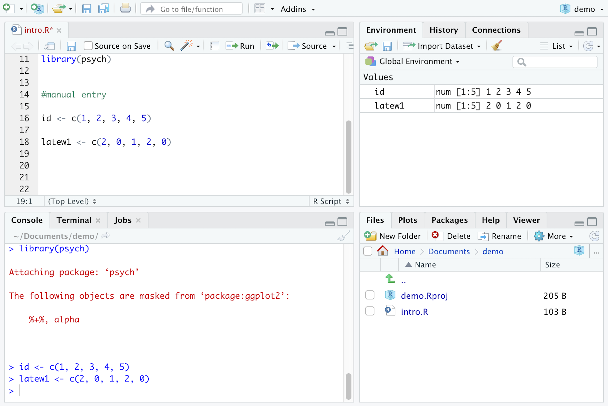   

Then enter the week 2 and 3 data with the following commands:  

`latew2 <- c(3, 0, 1, 2, 0)`   

*	This command is telling R to save an object called latew2 that is made up of this list of numbers (3, 0, 1, 2, 0).  

`latew3 <- c(2, 1, 0, 3, 0)`  

*	This command is telling R to save an object called latew3 that is made up of this list of numbers (2, 1, 0, 3, 0).   

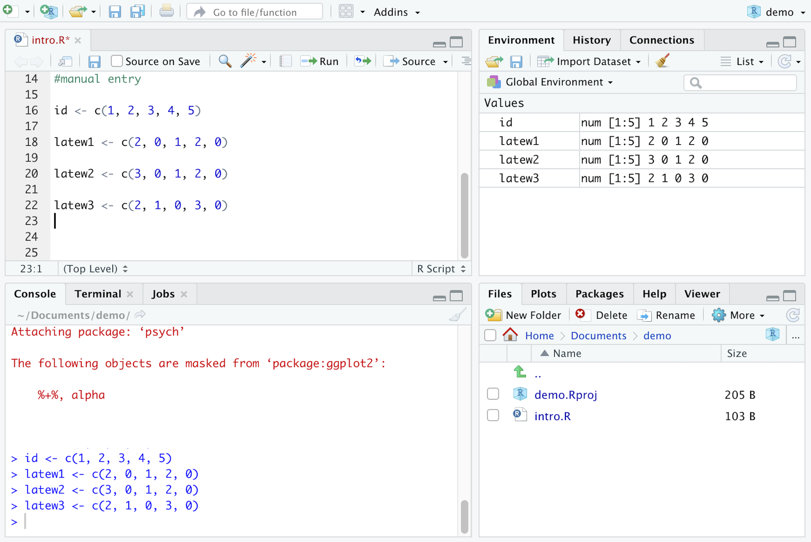   

These variables can be combined into one dataset object with the data.frame function. The basic setup of this function is:  

`DatasetName <- data.frame(Variable1, Variable2, etc)`  

*	Replace DatasetName  with what you want to call you data object. Like the variable names, dataset names should be informative but short (under 15 characters).   

In the current example the command would look like this:  

`tardy <- data.frame(id, latew1, latew2, latew3)`  

*	This command is saying to assign the data in the id, latew1, latew2, latew3 objects to a dataset object named tardy   

After you run this command, there will be a new object in the environment called tardy. Note that the tardy object is listed under data and the individual variables are listed under values.    

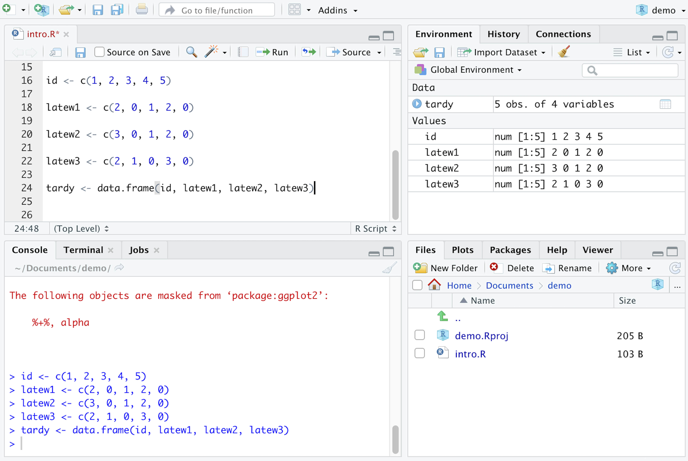    

  

### Upload data into RStudio Cloud  

When using RStudio in the cloud, you will first need to upload the data into your project on the website. To do this select the UPLOAD button in the files window. 

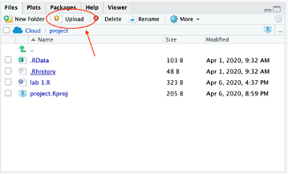

In the Upload Files window, click the CHOOSE FILE button and then navigate to the file on your computer. Then click the OK button. 

The data file should now be listed in the files section of RStudio. 

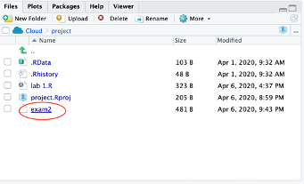

### Importing Data From Other Sources 
Often data is collected in a spreadsheet (like excel or google sheets) or through a survey manager (like Qualtrics or SurveyMonkey) and then is opened into RStudio. Before you can open a data file in RStudio, you need to know the format of the data file. See Table 1.1 for some common file extensions for data.  

Let’s open the data in the match.csv file (this is the data we will use in the data transformation section of this chapter, as well as in chapters 2 and 3). This data file contains data on 688 people currently on Match.com who were asked to complete a survey about themselves and their relationships. This survey included questions about whether or not they judge other people based on things like their appearance, possessions, etc., as well as demographic information such as highest level of education and age. (We will use this file to explore how judgmental people are on dating sites.)   

*	The first column contains arbitrary ID numbers to identify the participants   
*	The next column contains the participants’ ages
*	The third column contains the participants’ highest level of education
*	The following 12 columns contain the data from the judgement questions (0 = no; 1 = yes)
*	The remaining variables are not relevant to the current chapter, so they are not defined here. 

*note that this data is a subsample of a real data collected through the Kinsey Institute and match.com*

You can open data in RStudio using a point and click method or using a command.   

The point and click method of importing data in RStudio is simple and convenient. This method is accessed by clicking on the import dataset button in the environment and history pane.   

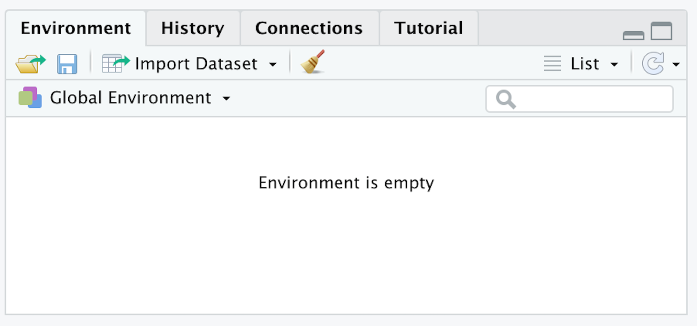    

Select one of the “from text” options if the data is formatted in a .csv or .txt file. (I tend to use the readr option here – but either works fine). Select the “from excel” option if the data is in a .xls or .xlsx format. Select the “from SPSS” option if the data is in a .sav format. Select the “from SAS” option if the data is in a .sasb7dat format. Select the “from Stata” option if the data is in a .dta format.  

Since the data is in a .csv file, let’s select the readr option.  

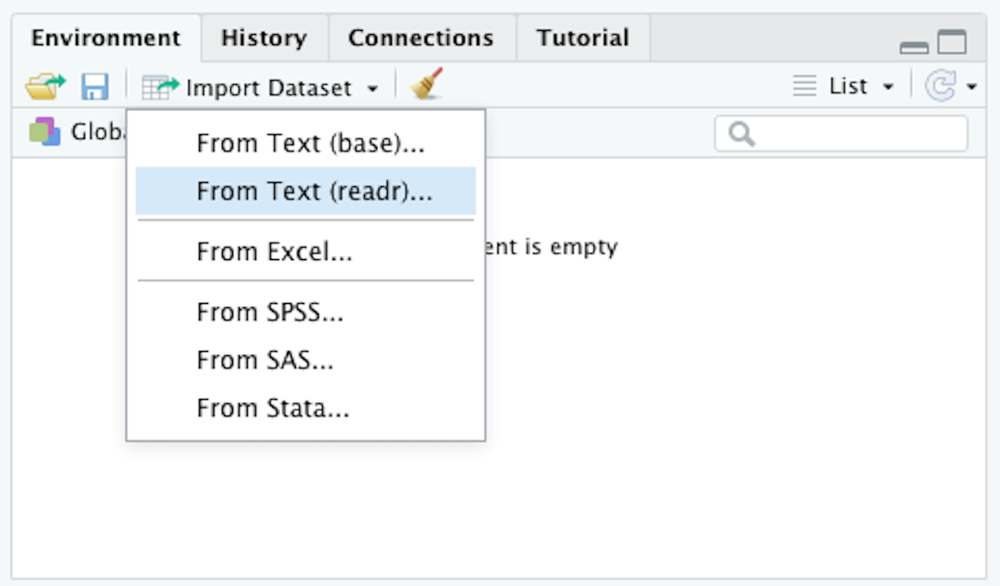  

The following window will open:  

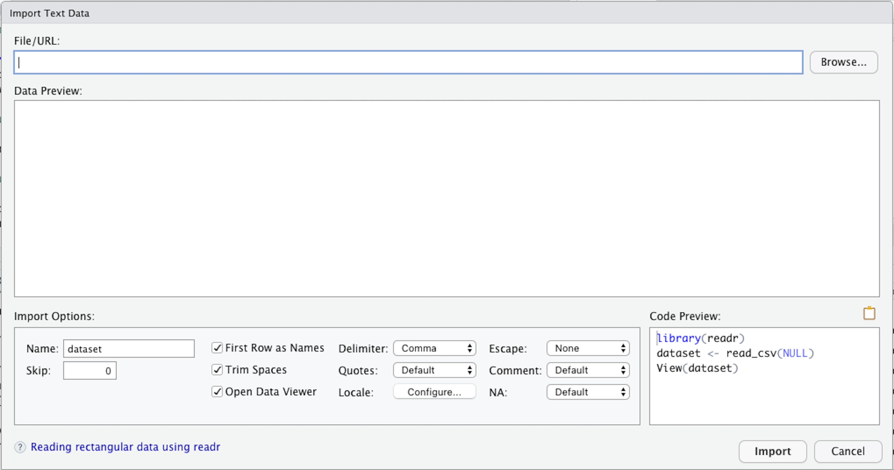    

Click on the BROWSE button. Then navigate to your file.  
 
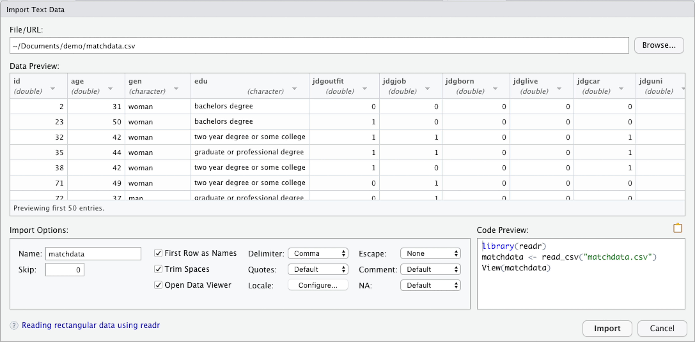  

Inspect the data preview. You should not need to change anything from the default import options.  

Before you click import, I suggest you copy the text in the code preview box. After you click import, paste it into your current script. This way you can easily reassign the datafile to an object if needed by running that command.  

After you click import, your screen will look like this:   

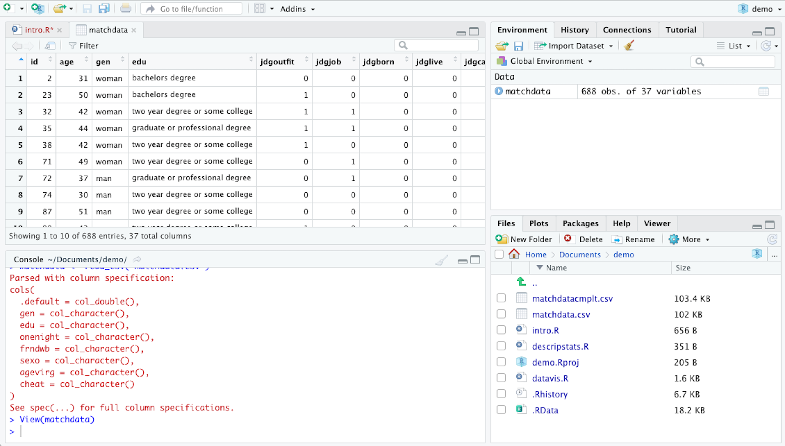    

The spreadsheet view of the match dataset will automatically open in the source pane. The variable names are listed at the top of each column, followed by the raw data. Scroll to the right to see all of the data. The object containing the match data will be listed in the environment.  We can see that this dataset has 688 observations and 37 variables.    

You can close the spreadsheet of the match dataset in the source pane by clicking on the x in the tab. If you would like to see the data again, click on the dataset’s object name (in this example match) in the environment tab and the spreadsheet will reopen in the source pane.  

You can also open csv data with `read_csv` function. The read_csv function is part of the readr package, which is part of tidyverse. So if tidyverse is loaded, you do not need to load readr. But if it is not, you can load it with this:   

`library(readr)`  

The basic set up of the read_csv function is:  

`DataObject <- read_csv("FileName.csv")`

*	This command is telling R to assign the data in a csv file named FileName to an object called DataObject.  
*	Replace DataObject with your preferred name for the object containing the data  
*	Replace FileName with the name of the file your data is in  

For example, to assign the match data to an object called match, the command would look like this:  
`match <- read_csv("matchdata.csv")`  

*	This command is telling R to assign the data in the matchdata.csv file to an object called match.  
*	Note that this is the same thing as what you copied and pasted during the point and click method.  

### Data Set Up

There are several types of data, or scales of measurement, for variables in RStudio. The big ones for us will be: double, which are numbers with decimals, positive/negative, fractions; integer, which are positive whole numbers; character, which are numbers and words, but as text; and factor which are categorical variables, with specific labels.   

The glimpse function, which is part of the tidyverse package, gives a nice summary of a dataset including the variable types for all the variables. In order to use this function, the tidyverse package should be loaded (see the loading packages section above).   

The basic layout of the glimpse function is:    

`glimpse(DataObject)`  

*	Replace DataObject with the name of the data object  

For example, to look at the data types of the variables in the match dataset use this command:  

`glimpse(match)`  

After this command is run, the output in the console looks like this:  

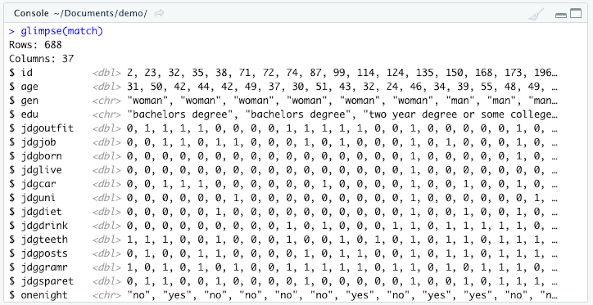   

The first column lists the names of all of the variables in the dataset. Next, in gray, are the variable types. The dbl stands for double, which is numbers with decimals, positive/negative, fractions. The chr stands for character, or text, data.  After the data type, the remainder of the row lists the raw data of the variable.  

The data type of a variable can be changed with the `as.*` function. The * is a placeholder for the different types of data. For example, `as.factor(VariableName)`, `as.character(VariableName)`, and `as.integer(VariableName)`.    

### Data Transformation 

Often times there is a need to change data in some way, such as combining variables together to create a summary score. These changes to data are called data transformations. This section covers how to use a RStudio to preform two common types of data transformations: computing a new variable and recoding values.  

Let’s pretend you were interested in how judgmental people are on dating sites. We can use the match data from the Importing Data section to do this. Remember that the participants completed items about whether or not they judge other people based on certain things. Here are the judgment items:  

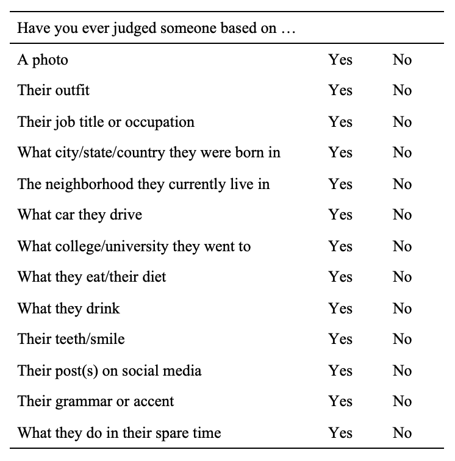 
Let’s create a total judgment score by summing all of the separate judgment items.   

To do this we will use the mutate function. The mutate function is part of the tidyverse package, so you should load tidyverse if you have not done so already (see the loading packages section above).   

The basic setup of this function is:  

`mutate(NewVariableName = New variable equation)`

*	Replace the NewVariableName with the variable name you want. There cannot be spaces or symbols in a variable name. And remember that R is case sensitive, so be mindful of your use of upper and lower case letters. Then list the equation after the equal sign.  

In addition, you need to tell R which data object to work with. Adding this information makes the command look like this:  

`DataObject %>%`  
    `mutate(NewVariableName = New variable equation)`  
    
*	The `%>%` is called a pipe. Pipes are a way to write strings or series of functions more easily. You can think of it as saying “then”.   
*	In this example you can read the command as saying “use the data in the object called DataObject then mutate the variables in that dataset by creating a new variable called NewVariableName which is defined by this equation.  
*	Pipes are part of the tidyverse package.  

Finally, you need to tell R to save the new variable. Do this with the assignment operator (`<-`).   

If you want the new variable to be added to a dataset in an existing object, then tell R to reassign the object as itself like this:  

`DataObject <- DataObject %>%`   
    `mutate(NewVariableName = New variable equation)`  
  
Or you could tell R to save the variables in the existing dataset plus the new variable by assigning the work to a new object:  

`NewDataObject <- DataObject %>%`    
    `mutate(NewVariableName = New variable equation)`  
    
*	This will save all of the variables in the object named DataObject, plus the variable named NewVariableName into a new object called NewDataObject. After this command is run, NewDataObject will be listed in the environment.  

For our current example, let’s add the total judgment score variable to the match dataset. Here is the command to do so:  

`match <- match %>%`   
   `mutate(judgmt = jdgoutfit + jdgjob + jdgborn + jdglive + jdgcar + jdguni + jdgdiet + jdgdrink + jdgteeth + jdgposts + jdggramr + jdgsparet)`  
   
*	The `match <-` part of the command tells R to resave the new variable in the object called match.   
*	The `match %>% mutate` part tells R to use the data in the object called match then mutate…  
-	Inside the parenthesis is the new variable, which I called judgmt and its equation, which is the sum of the 12 judgment items.  
  
After this command is run, there will be 38 variables in the dataset object called match (remember that originally there were 37).  

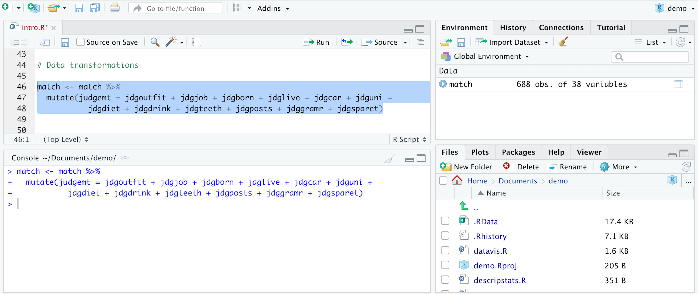   
  
If you want, you can see the new variable by opening the dataset (click on the object listed in the environment) and then scroll to the right. The new variable will be in the last column.   

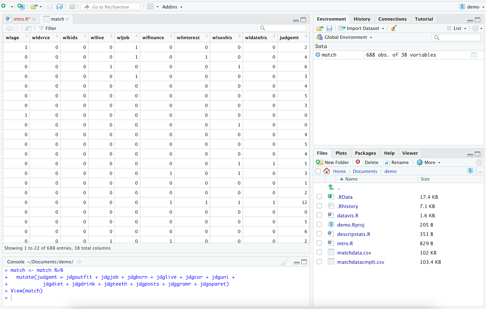   

Next let’s review how to recode a variable.  

Still using the match data, let’s pretend you wanted to recode the number of second dates that participants reported having in the last year (This variable is called scnddates). We can see in the codebook that the response options range from 0 to “over 20”. Let’s recode this variable into categories. Let’s say that we want to know the number of people that had 0 second dates, and then 1 or 2 second dates, 3 or 4 second dates, and then 5 to 9, 10 to 14, 15 to 19, and 20+.   

We can do this with the `cut` function, which is a pretty cool function of the tidyverse package. Here is the basic command:  

`DataObject <- DataObject %>%`   
    `mutate(VariableCat = cut(x = Variable,`  
              `breaks = c(-Inf, N, Inf),`  
              `labels = c("-Infinity", "N” "Infinity")))`  
              
*	Replace DataObject with the name of the object containing the data that you are working with.  
*	Replace VariableCat with whatever you want the new variable to be called. I like to use the original variable name followed by “Cat” (for categorical).  
*	Replace Variable with the name of the variable you are recoding.   
*	Replace the entries in the breaks parenthesis with where you would like to cut the original variable. First list the lowest value of the first category – I like to use -Inf (where Inf stands for infinity). Then list the highest value of each category separated by commas (i.e., the second number listed is the highest value of the first category, the third number is the highest value of the second category, and so on). I like to end with Inf, you could also end with the highest value of the last category.   
*	Replace entries in the in labels parenthesis with the corresponding labels that you listed in the breaks.   
  
In the match example this command would look like:  
   
`match <- match %>%`   
    `mutate(scnddatesCat = cut(x = scnddates,`  
              `breaks = c(-Inf, 0, 2, 4, 10, 15, Inf),`  
              `labels = c("0", "1 or 2", "3 or 4", "5 to 9", "10 to 15", "over 15")))`  

After this command is run from the script, your screen will look like this:

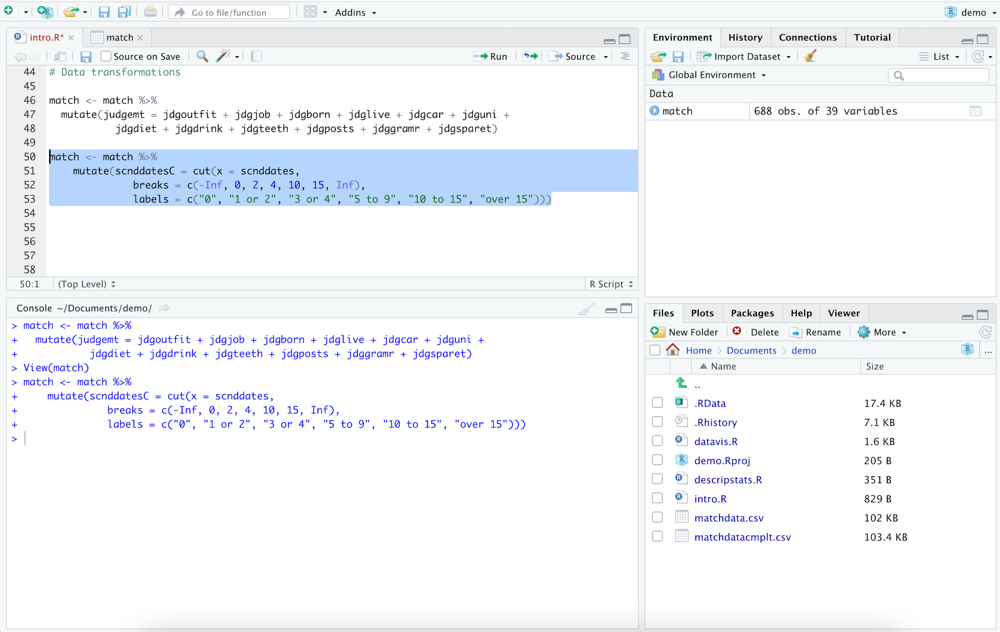 

There are now 39 variables in the dataset object called match.  

Finally, a common type of data transformation in psychology is recoding responses made on a Likert scale. It is common in psychology to have some items of a survey negatively worded and others positively worded. When this happens, we need all of the items to go in the same direction in order to analyze the data. We do this by reverse coding the items going in one direction – so that a high score on all of the items reflect the same thing.  

To reverse code in RStudio, we will use the mutate and recode functions of tidyverse. The basic form of this command is:  

`DataObject <- DataObject %>%`   
                 `mutate(ItemR =recode(Item, `OldValue1` = NewValue1, `OldValue2` = NewValue2, Etc.)`  
                 
*	Replace DataObject with the name of the data object  
*	Replace ItemR with whatever you want the new variable to be called. I like to use the original variable name followed by “R” (for reverse).  
*	Replace Item with the name of the item that needs to be reverse coded.   
*	Next is a list of the old and new variables. On the left is the old variable and it must be in back ticks (`) when it is a number. String (AKA text) variables should be in quotes ("). On the right is the new value.  

For example, if responses to the items of a measure were on a 5-point Likert scale and item 2 needed to be reverse coded, the command would look like this:   

`data <- data %>%`  
   `mutate(item2r =recode(item2, `1` = 5, `2` = 4, `3` = 3, `4` = 2, `5` = 1))`  
     
*	The data object is called data  
*	item2r will be the name of the new variable.  
*	item2 is the item that is being recoded.  
*	All of the 1’s in the data will be recoded as 5’s  
*	All of the 2’s in the data will be recoded as 4’s  
*	All of the 3’s will remain 3’s  
*	All of the 4’s in the data will be recoded as 2’s  
*	All of the 5’s in the data will be recoded as 1’s  

