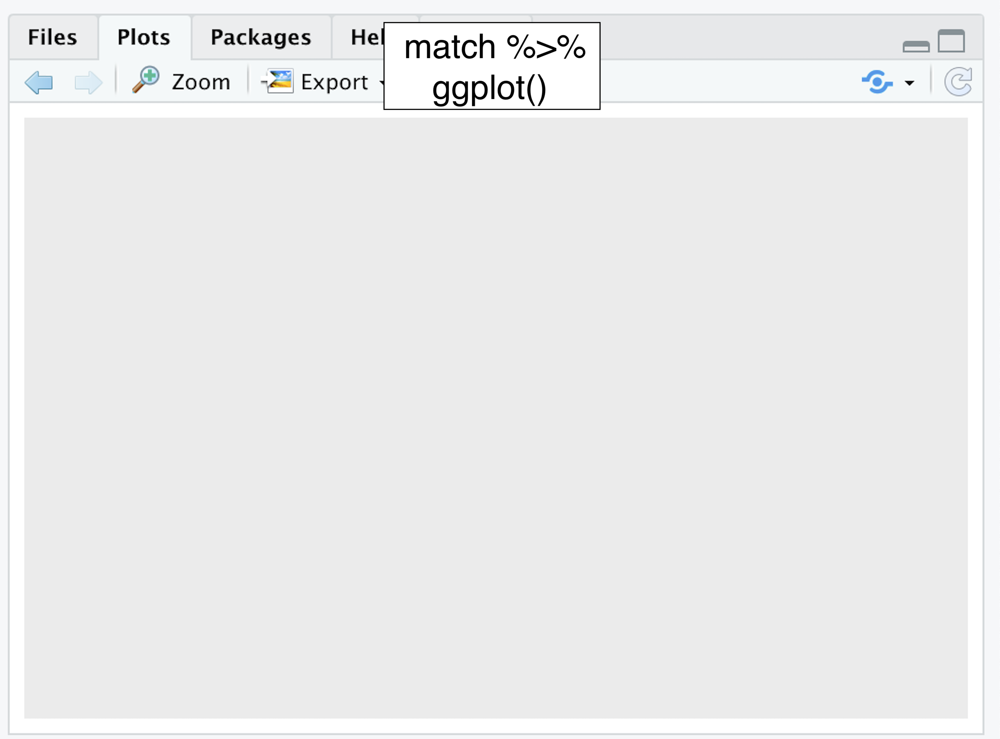
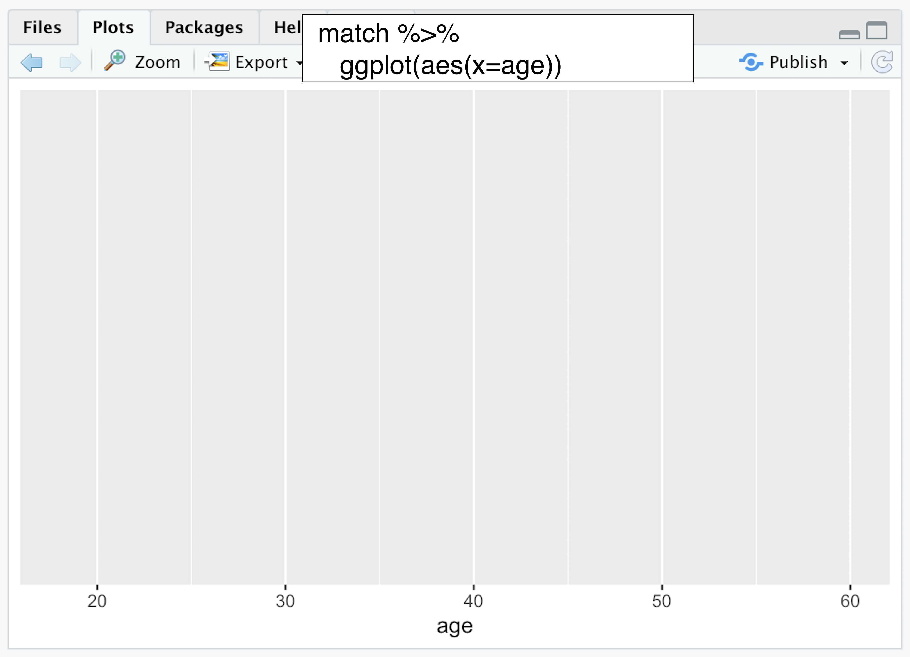
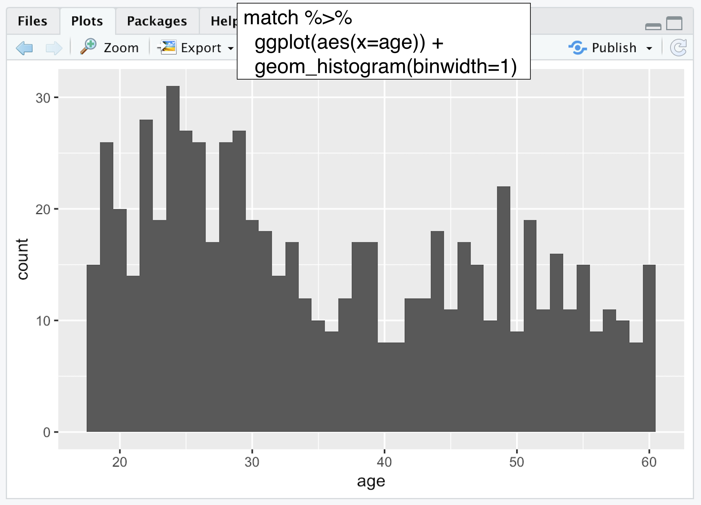
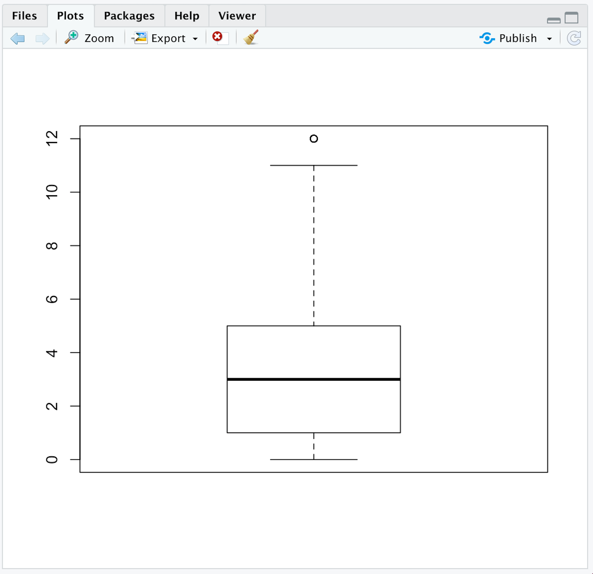

# Picturing Data

```{r, include = FALSE}

library(tidyverse)
library(psych)

match <- read_csv("matchdatacmplt.csv")


```

The first step of data analysis is to look at your data with graphs. Graphs of data are also used to convey the results of a study. In this chapter you will learn how to use RStudio to create frequency distributions, histograms, boxplots, scatterplots, and bar graphs. 

## RESEARCH QUESTION  

How often do people judge others? Let’s say that we are interested in how judgmental people are on dating sites. Moreover, let’s pretend to be interested in whether people’s tendencies to judge are related to their age and education. 

## METHOD 

Pretend that you worked with Dr. Amanda Gesselman and her colleagues at the Kinsey Institute to create self-report survey items about how often participants judge others. These items were added to a longer semi-proprietary survey about the attitudes and behaviors of single people in the US. This survey was sent to certain people with accounts on match.com. The people were selected so that the demographics match the most recent US census, with oversampling for gay, lesbian, and bisexual participants. Thousands of people completed the survey. We will use a random sample of 688 people from the total sample here.  


## DATA ANALYSIS OVERVIEW

The data is in file matadatacmplt.csv. This is the same dataset that we used in chapter 1 - except that the total judgement variable is included matadatacmplt and not in the matchdata.csv file. (note that this data is a subsample of real data collected through the Kinsey Institute and Match.com)


•	The first column contains arbitrary ID numbers to identify the participants   
•	The next column contains the participants’ ages
•	The third column contains the participants’ highest level of education
•	The following 12 columns contain the data from the judgement questions (0 = no; 1 = yes)
•	The judgmt column contains the total number of times the participants reported judging others on the 12 items. (this is the variable you made in the data transformation section of chapter 1)
•	The remaining variables are not relevant to the current chapter, so they are not defined here. See the codebook (matchcodebook.xlsx) for more information. 


After we open the data in RStudio, we will look at it with tables and graphs.

Frequency distributions, histograms and boxplots help you get to know your data and check for errors. Frequency distributions are tables that list all possible values or categories of a variable and their frequency within a study or data set. Histograms are a graph of a frequency table, where all possible values of a variable are on the x-axis and the frequency of each value is on the y-axis.

Boxplots (AKA box and whisker plots) are another way to graphically represent data. The y-axis of a boxplot lists the possible values of a variable. The box represents the Interquartile range (IQR), which is the middle 50% of scores. The line withing the box shows the median. The highest and lowest scores are represented as whiskers if they are within a certain range (1.5 * IQR). If they are outside of this range, they are represented with a dot because they are considered an outlier. A traditional boxplot can be modified to include dots that represent individual data points (this is becoming increasingly popular because it encourages research transparency). Another popular modification is a violin element, which shows the distribution of the individual data points.   

Scatterplots and bar graphs help show your results to others. Scatterplots show the association between two variables. One variable is plotted on the y-axis and the other is plotted on the x-axis. Each dot represents one participant, measured on the two variables. Bar graphs show the association between continuous and categorical variables. They present the means of a continuous variable separately for each level of a categorical variable. Error bars representing the 95% confidence interval (CI) for each mean should be included in order to represent the variability in the data. 

## OPEN DATA

First assign the dataset to an object called match (or whatever you prefer). You can do this with the point and click method by selecting from the environment menu: 

IMPORT DATASET -> FROM TEXT (READR)


Click the BROWSE button and then navigate to your file’s location on your computer. Then click OPEN and then IMPORT.  

Or you could use the following code:    

`match <- read_csv("matchdatacmplt.csv")`

*	This command is telling R to assign the data in the matchdatacomplt.csv file to an object called match.   

Your screen should look like this after the data is imported:  


## FREQUENCY DISTRIBUTION

Let’s first create a frequency distribution of the education variable. One way to do this is with the count function, which is part of the tidyverse package. This function counts the unique values of a variable. 

In order to use the count function the tidyverse package must be loaded. If it is not already loaded, load it with this command:

`library(tidyverse)`  
(or you could use the point and click method described in chapter 1)  

Here is the command to use the count function:  

`DataObject %>%`   
  `count(VariableName)`  

*	This command is saying to first go to the dataset named DataObject and then count all of the unique values of the variable VariableName.
*	Replace DataObject with the name of the object that is storing the data.
*	Replace VariableName with the name of the variable you would like to count.

In this example, use the following command to create a frequency table of the education variable:  

`match %>%`   
  `count(edu)`  

*	This command is telling R to use the data is the match object and count the variable called edu. 

The frequency table will appear in the console. Your screen should look like this:   


The first column of the frequency table lists the levels of the education variable. The NA means not available. This means that this data is missing. 

The categories in the frequency table are listed in alphabetical order by default. It is possible to change the order in which RStudio lists the levels of a factor. In the current example it would be nice for the education categories to appear in progressive order. We can do this by using the reorder function, which is part of base R, so no packages need to be loaded in order to use it. Here is what the function looks like in general:  

`DataObject$VariableName <- factor(DataObject$VariableName,levels = c("Level1Name", "Level2Name", "Level3Name", "Level4Name"))`

*	The `DataObject$VariableName <-` saves the reordered levels of the variable called VariableName in the data object called DataObject. Without this the information will not be saved for future use.   
*	The `factor(DataObject$VariableName,levels = c("Level1Name", "Level2Name", "Level3Name", "Level4Name"))` part is what reorders the levels of the factor. The levels should be listed in the new order.  
*	Replace each DataObject with the name of the object that is storing the data.  
*	Replace each VariableName with the name of the variable you would like to count.  
*	Replace the Level1Name with the name of the factor level that you would like to appear first, the Level2Name with the name of the factor level that you would like to appear second, etc.   

In the current example this looks like this:    

`match$edu <- factor(match$edu,levels = c("high school degree or less", "two year degree or some college", "bachelors degree", "graduate or professional degree"))`   

After you run the reorder command, rerun the count command. The order of the educational attainment categories in the table will now be displayed in sequential order.   

  

The frequency table show that there are 86 people with a high school degree or less; 244 people with an associate, vocational, technical degree or some college, 245 people with a bachelor’s degree, and 112 people with a graduate degree. There is missing data for one person. The total sample is 688.  

Often, we want to know the percentages of the total sample that the raw frequencies represent. While we could add code to the count function in order to get this information (see appendix for this code), an easier way to get this information is to use a the freq function of the descr package.  

In order to use this function the descr package must first be installed. Here is the command to install it:   

`install.packages("descr")`   
(or you could use the point and click method described in chapter 1)   

Once the package is installed, load it with this command:  

`library(descr)`  
(or you could use the point and click method described in chapter 1)

The freq command looks like this: 

`freq(DataObject$VariableName)`

*	Replace DataObject with the name of the object that is storing the data.  
*	Replace VariableName with the name of the variable you would like to count.  

In the current example it would look like:  
`freq(x = match$edu)`  

Here is what your screen should look like:  

  

Note that the plot on the left-hand side is not very informative. You can suppress this by adding `plot = FALSE` in the parenthesis:    

`freq(x = match$edu, plot = FALSE)`    

The percent column converts the raw frequencies to percentages of the total sample including any missing data. The valid percent column converts the raw frequencies to percentages of the number of non-missing data points. Because there is one data point missing in this example, the percent and valid percent columns are slightly different.  


## HISTOGRAMS

Next let’s create a histogram of the age variable. One way to do this is with the hist function, which is part of base R and looks like this:  

`hist(DataObject$VariableName)`  

*	Replace DataObject with the name of the object that is storing the data.  
*	Replace VariableName with the name of the variable you would like to plot.  

Because it is part of base R, no package needs to be loaded in order to use it.   

In this example the command to create a histogram of the age variable is:  

`hist(match$age)`  

The plot will appear in the bottom left pane.   

```{r, echo = FALSE}

hist(match$age)

```


This histogram provides a more detailed picture of the data because each bar represents the frequency of two years, while the bin width of the histogram that was created with the hist function was 5.   

Ggplot is typically taught with the analogy of a globe that is built one layer at a time. It starts with a world of only ocean (no land). Then “layers” of land, colors, terrains, legends, etc. are progressively added with additional commands. Use a plus sign (+) to add the layers.  

Let’s break down the command we used to create the histogram of age to see the step-by-step, layer-by-layer progression of commands that create a ggplot.   

First the data set object and the ggplot function creates the blank globe with only ocean:  

   

The aesthetic mapping adds the variable data:  

    

Then the `geom_histogram` adds the graph:   

  

Throughout this book we will add on different types of graphs and details to ggplot graphs.  

## BOXPLOTS

Let’s use a boxplot to look at the data of the judgment variable. This can be done through base R with the boxplot function:   

`boxplot(DataObject$VariableName)`  
  
*	Replace DataObject with the name of the object that is storing the data.  
*	Replace VariableName with the name of the variable you would like to plot.  

In this example it would look like:  

`boxplot(match$judgmt)`  

After this command is run, the graph will appear in the plots pane:  

   

The boxplot shows that most people in our sample are not very judgmental – 50% of the data is between 1 and 5 on a 12-point scale. However, the top whisker and outlier point suggest that there are few people in the sample who are very judgmental.   

As with the histogram, many people prefer to use ggplot to create a boxplot because it is customizable. The command to do this is:  

`DataObject %>%`   
  `ggplot(aes(x = "", y = VariableName)) + `  
  `geom_boxplot()`  
  
*	Replace DataObject with the name of the object that is storing the data.  
*	Replace VariableName with the name of the variable you would like to plot.  
*	The ""is a placeholder because we want the frequency of Y (rather than adding a second variable).   

In the current example the command looks and resulting graph likes this:   

```{r message=FALSE, warning=FALSE}
match %>% 
  ggplot(aes(x = "", y = judgmt)) +
  geom_boxplot()

```


This looks very similar to the base R boxplot. However, unlike in base r, additional elements and details can be added to the boxplot when using ggplot. For example, individual data points can be added to a boxplot with the geom_point option:  

`DataObject %>%`   
  `ggplot(aes(x = "", y = VariableName)) + `  
  `geom_boxplot() +`  
  `geom_point()`  
  
* Replace DataObject with the name of the object that is storing the data.
*	Replace VariableName with the name of the variable you would like to plot. 
*	The geom_point()tells R to add the raw data to the boxplot. Add `position = "jitter", color = "grey" in the geom_point parentheses(i.e., geom_point(position = "jitter", color = "grey")` if there are a lot of participants in the dataset because it helps with readability. It is telling R to jitter, or to add random noise to the data points. Without it the data points would overlap each other. The color adds color to an object. I picked grey here, but you can pick any color (yellow, blue, etc.). The point of the color is to make it easier to tell the difference between the data and the rest of the graph.  

Because the N for the match data set is on the larger side, we should add the jitter and color to the data points.  

Here is what the command and graph look like for the current example:

```{r message=FALSE, warning=FALSE}
match %>% 
  ggplot(aes(x = "", y = judgmt)) +
  geom_boxplot() +
  geom_point(position = "jitter", color = "grey")

```

This graph shows us that there are more data points at the bottom of the judgmental distribution (less judgmental) than the top.   

Instead of the individual data points, the distribution of data points can be added to a boxplot with the geom_violin option like this:    

`DataObject %>%`   
  `ggplot(aes(x = "", y = VariableName)) +`   
  `geom_boxplot() +`  
  `geom_violin(alpha = .5)`  
  
*	Replace DataObject with the name of the object that is storing the data.  
*	Replace VariableName with the name of the variable you would like to plot.  
*	The alpha = . 5 tells R to make the violin distribution transparent so that the boxplot is still visible. The alpha makes objects transparent. I pick .50, which is half transparent, .75 would be darker and .25 would be lighter.  

Which looks like this in the current example:


```{r message=FALSE, warning=FALSE}
match %>% 
  ggplot(aes(x = "", y = judgmt)) +
  geom_boxplot() +   
  geom_violin(alpha = .5)

```

In this example, the violin plot does a better job at showing that there are more people at the lower end of the distribution of judgmental scores.   

## SCATTERPLOTS

Next let’s create a scatterplot between the judgement and age variables. One way to do this is with the plot function of base R, which looks like this:  

`plot(DataObject$Variable1Name, DataObject$Variable2Name)`  

*	Replace DataObject with the name of the object that is storing the data.  
*	Replace Variable1Name with the name of one of the variables and Variable2Name with the other.  
    
In the current example, the plot function would look like this:   

```{r message=FALSE, warning=FALSE}
plot(match$judgmt, match$age)
```
  
The ggplot command for a scatterplot is:  
  
`DataObject %>% `  
  `ggplot(aes(x = Variable1Name, y = Variable2Name)) + `  
  `geom_point()`  
  
*	Replace DataObject with the name of the object that is storing the data.  
*	Replace Variable1Name with the name of one of the variables and Variable2Name with the other.  

In the current example this would look like this:

```{r message=FALSE, warning=FALSE}

match %>% 
  ggplot(aes(x = age, y = judgmt)) +
  geom_point()


```

Here you can see a slight negative trend, such that the younger people in the sample have slightly higher judgmental scores than the older people in the sample (the correlation coefficient (r) = -.15).  


## BAR GRAPH 

Finally, let’s make a bar graph of an association between a categorical and continuous variable. For this example, let’s look at the association between education and how many times participants reported judging others. To do this we will make a graph of the mean judgment score for each level of education.  

Since we are plotting a summary statistic (a mean) instead of raw data (as we did with the histogram and scatterplot), we have to set up our ggplot command a little differently. After specifying the data object and aesthetic, we will use the stat_summary function to tell R that we want to plot the means with a bar graph. Here is what this looks like:  

`DataObject %>% `  
  `ggplot(aes(x = Variable1Name, y = Variable2Name)) + `  
  `stat_summary(fun = mean, geom = "bar")`  
  
*	Replace DataObject with the name of the object that is storing the data.
*	Replace Variable1Name with the name of the categorical variable and Variable2Name with the name of the continuous variable.

Here is the command and graph for the current example:

```{r message=FALSE, warning=FALSE}

 match %>% 
  ggplot(aes(x = edu, y = judgmt)) +
  stat_summary(fun = mean, geom = "bar") 

```


The graph includes the mean for the one person who did not complete the education question of the survey. The NA category can be dropped by adding the drop.na function to the ggplot plot by adding `drop_na(Variable1Name) %>%`. In the current example this looks like:    

```{r message=FALSE, warning=FALSE}

match %>% 
  drop_na(edu) %>%
  ggplot(aes(x = edu, y = judgmt)) +
  stat_summary(fun = mean, geom = "bar")


```

Finally, 95% confidence intervals around each mean should be added. Use another stat_summary function to tell R that you would like to plot the standard of the mean with error bars by adding this line `  stat_summary(fun.data = mean_se, geom = "errorbar", width = .3)`.  In the current example this looks like:  

```{r message=FALSE, warning=FALSE}
match %>% 
  drop_na(edu) %>%
  ggplot(aes(x = edu, y = judgmt)) +
  stat_summary(fun = mean, geom = "bar") + 
  stat_summary(fun.data = mean_se, geom = "errorbar", width = .3) 

 
 
```

Finally, if you would like to present this graph professionally, the additional options can be added to the ggplot command to adjust color and labels. The theme_classic function will change the background to white, remove gridlines and add x and y axis lines. The xlab and ylab function will add labs to the respective axis.  

```{r message=FALSE, warning=FALSE}
match %>% 
  drop_na(edu) %>%
  ggplot(aes(x = edu, y = judgmt)) +
  stat_summary(fun = mean, geom = "bar") + 
  stat_summary(fun.data = mean_se, geom = "errorbar", width = .3) +
  theme_classic() +
  xlab("Education") + ylab("Mean Judgement Score")

```

This graph shows that the mean judgmental score increases with educational attainment.   


